> AI 没有取代 DBA，而是把 DBA 从重复劳动里解放出来。前提是——DBA 得先学会用 AI。

在互联网大厂做了 17 年数据库运维，我对这套工作流的每一环都熟到骨子里：
监控告警、慢SQL、故障排查、巡检报告、知识沉淀、容量规划。
AI 进来之后，我重新梳理了一遍——哪些能放手，哪些必须人来。

## 工作形态变了什么

| 维度 | 过去（人肉） | 现在（AI辅助） |
|:----|:------------|:--------------|
| 监控告警 | 盯着监控屏，被告警轰炸 | AI 降噪、聚类、根因分析 |
| 慢SQL | 翻慢日志，EXPLAIN，靠经验改 | AI 分析日志、改写SQL、推荐索引 |
| 故障排查 | 半夜爬起来，逐条查日志 | AI 先过一遍日志，给出嫌疑点 |
| 巡检报告 | 手动汇总写报告，半天没了 | AI 自动汇总，生成日报周报 |
| 知识沉淀 | 踩过的坑记在脑子里，离职就带走 | AI 知识库，坑变成可检索资产 |

## 哪些环节 AI 真正靠谱（可以放手）

1. **慢SQL分析与改写** — 大模型对 SQL 的理解已经很强，第一轮分析交给 AI，准确率足够
2. **日志初步排查** — 让 AI 先读日志、给嫌疑点，人再确认，效率翻倍
3. **巡检报告生成** — 结构化输出，模板化，AI 干这个又快又好
4. **知识库问答** — 把文档、踩坑记录喂给 AI，变成 24 小时在线的"老师傅"

## 哪些环节 AI 不可靠（必须人来）

1. **架构设计** — 分库分表、高可用方案，AI 给不了业务判断
2. **复杂故障根因** — AI 给的是"嫌疑"，最终定位还是要靠人的全局理解
3. **数据安全与合规** — AI 不懂你的业务红线
4. **和业务方沟通** — "这个查询为什么慢"，AI 解释不了业务上下文

## 可落地的运维流程

拿我自己最近在跑的流程举例——日常巡检环节：

```mermaid
flowchart LR
  A([采集数据]) --> B{AI 汇总生成报告}
  B --> C[人审阅异常项]
  C -->|有异常| D[AI 给根因嫌疑点]
  C -->|无异常| E[归档进知识库]
  D --> F[人确认处理]
  F --> E
  E -. 喂回模型 .-> B
  style A fill:#0b1a20,stroke:#34d399,stroke-width:2px
```

告警响应的链路是这样：AI 先降噪聚类，把 200 条告警压成 3 个根因嫌疑，人才介入确认处理。

```mermaid
flowchart TD
  A([告警风暴]) --> B[AI 降噪聚类]
  B --> C{根因嫌疑}
  C --> D[慢查询]
  C --> E[连接耗尽]
  C --> F[主从延迟]
  D & E & F --> G[人确认处理]
  G --> H[沉淀进知识库]
  H -.-> B
  style A fill:#0b1a20,stroke:#34d399,stroke-width:2px
```

> 一句话：会用 AI 的 DBA 淘汰不会用 AI 的 DBA，但不会因为 AI 本身被淘汰。

这套流程我在多个业务团队落地过。如果你们团队也想把 AI 接进数据库运维，
我可以按项目协助——从 AI 巡检、慢SQL自动改写到运维知识库搭建。

---

如果你也遇到类似的数据库问题（慢查询、故障、迁移、架构），
或者想用 AI 提升运维效率，欢迎联系我。
多年互联网大厂数据库经验，可提供技术支持 / 外包服务。
联系方式见[关于](/about)页。
