> 这篇是"服务说明"——你能找我解决什么问题、怎么合作、大概什么节奏。

## 你可能会遇到的情况

- 数据库越来越慢，不知道从哪下手
- 半夜总被告警吵醒，想睡个安稳觉
- 想用 AI 提升运维效率，但不知道怎么落地
- 团队缺一个懂数据库的人，想找个靠谱技术兼职

这些我都能接。下面把合作方式说清楚，不绕弯子。

## 三种合作方式

### 1. 远程技术支持（按次）

适合"一次性的痛"。比如一条慢查询、一次数据迁移、一个高可用改造。

**流程：**

```mermaid
flowchart LR
  A([描述问题 + 现场信息]) --> B[我先诊断给结论]
  B --> C{确认方案}
  C -->|同意| D[远程执行 / 全程指导]
  C -->|不接受| E[不收费，好聚好散]
  D --> F[验收 + 沉淀文档]
  style A fill:#0b1a20,stroke:#34d399,stroke-width:2px
```

> 原则：**先给价值，再谈钱。** 诊断阶段不藏着掖着，让你判断值不值得继续。

### 2. 应急响应

适合"半夜着火"的场景。大促前、上线前、已经出了故障——我见过的生产事故比你预想的多。

- 首次响应：远程接入，先止血，再定位根因
- 事后交付：完整复盘报告 + 防复发清单
- 可签 SLA：约定响应时间，超时免责

### 3. 长期技术兼职 / 驻场

适合"团队缺一个懂数据库的人"。

- 远程 DBA：日常巡检、告警处理、容量规划，每周交付周报
- 项目技术兼职：迁移、架构设计、性能专项，按项目报价
- 知识库共建：把你们的踩坑记录沉淀成 AI 可检索的资产

## 我的底气

- **17 年互联网大厂数据库经验**：服务过千万级数据量的系统，处理过数不清的生产故障
- **懂 AI**：AI 巡检、慢SQL自动改写、日志根因分析、知识库搭建，帮团队把 AI 用起来
- **案例脱敏**：真实但不暴露你的业务信息

---

如果你有数据库的问题，或者想用 AI 提升运维效率，欢迎联系我。
多年互联网大厂数据库经验，可提供技术支持 / 技术兼职服务。
联系方式见[关于](/about)页。