> 结论先给：第一轮分析交给 AI，准确率足够；但上线前，人必须验证执行计划。

在大厂干数据库的 17 年里，慢SQL 是我处理最多的"常规单"。以前是翻慢日志、EXPLAIN、
靠经验改，一条查询从定位到上线少说两小时。这次我拿一条真实慢查询，全程让 AI 走了一遍。

## 实测场景

某订单查询，`orders` 表 800 万行，`order_no` 走唯一索引。这条 SQL 平均耗时 **2.3s**：

```sql
SELECT * FROM orders
WHERE status = 1
  AND created_at BETWEEN '2026-07-01' AND '2026-07-31'
ORDER BY amount DESC
LIMIT 20;
```

## AI 的第一轮判断

把慢日志和建表语句丢给 AI，它给出的分析：

1. **`status` 字段选择性太低**（只有 1/5 取值），单靠它建索引没用
2. 真正的过滤条件应该是 `created_at`，建议建复合索引 `(status, created_at, amount)`
3. 改写建议：把 `ORDER BY amount DESC` 纳入索引，避免文件排序

## AI 改写的 SQL

```sql
SELECT * FROM orders
WHERE status = 1
  AND created_at >= '2026-07-01' AND created_at < '2026-08-01'
ORDER BY amount DESC
LIMIT 20;
```

> 技巧点：`BETWEEN` 改成 `>=` + `<`，更容易命中索引范围，也让优化器能正确估算。

## 人要做的事（AI 干不了）

AI 给的是"嫌疑"，最终还得人确认：

1. 在预发环境跑一遍 **EXPLAIN**，确认走 `idx_status_created_amount` 而不是全表扫
2. 确认没有破坏业务语义（比如跨时区的时间边界）
3. 评估这个复合索引对写库的影响（`orders` 表写入频繁）

## 完整的优化链路

```mermaid
flowchart LR
  A([慢日志采集]) --> B[AI 分析 + 改写 + 索引建议]
  B --> C{人验证执行计划}
  C -->|通过| D[预发灰度上线]
  C -->|不通过| E[回退并补充业务上下文给AI]
  D --> F[观测 QPS / 耗时对比]
  F -->|达标| G[归档进知识库]
  F -->|未达标| B
  E --> B
  G -. 喂回模型 .-> B
  style A fill:#0b1a20,stroke:#34d399,stroke-width:2px
```



## 效果对比

| 指标 | 优化前 | 优化后 |
|:-----|:------|:------|
| 平均耗时 | 2.3s | 96ms |
| 扫描行数 | 全表 | 约 12 万行 |
| 人为投入 | 2 小时 | 15 分钟 |

## 我的判断

**AI 是帮手，不是忽悠。** 前提是：AI 干分析，人干判断，各有分工。
把慢SQL 第一轮分析交给 AI，准确率足够，省下的时间可以去处理架构级问题。

---

如果你也遇到类似的数据库问题（慢查询、故障、迁移、架构），
或者想用 AI 提升运维效率，欢迎联系我。
多年互联网大厂数据库经验，可提供技术支持 / 外包服务。
联系方式见[关于](/about)页。